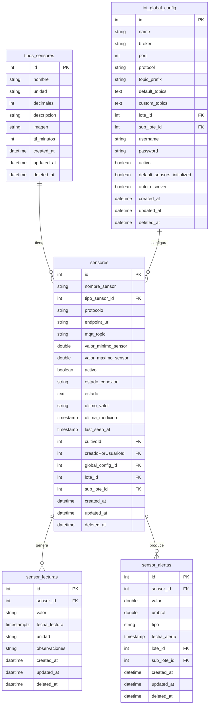
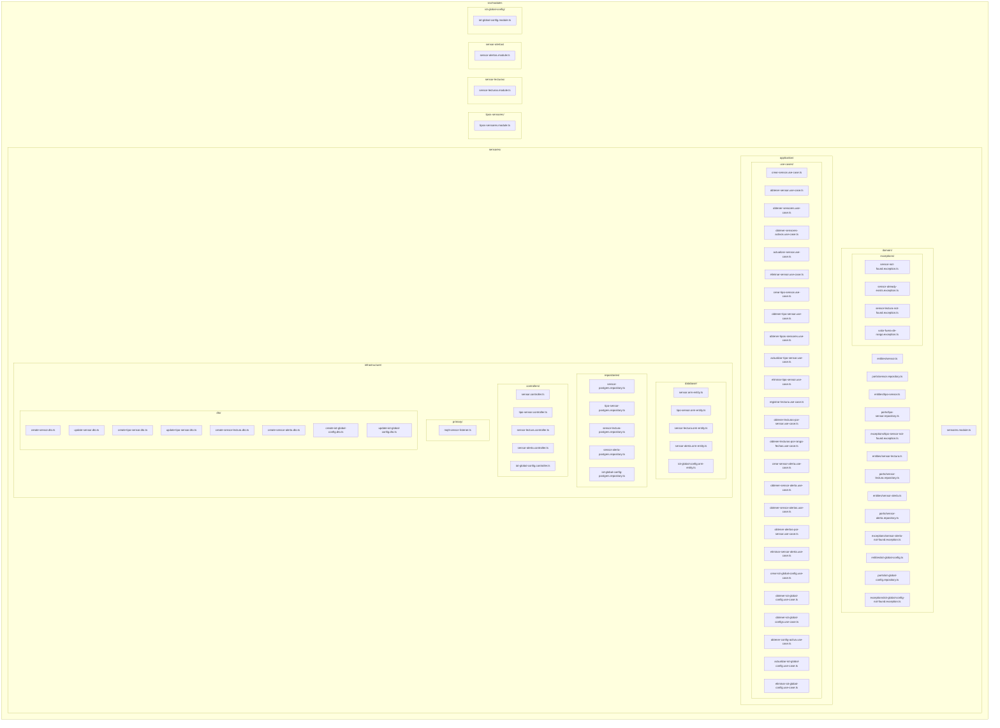
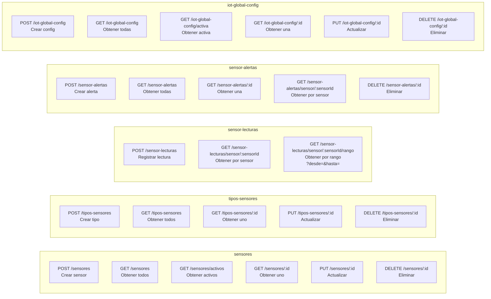

# Arquitectura de Módulos - Bd_AgroSoft

## Diagrama de Arquitectura Hexagonal

```mermaid
graph TB
    subgraph "INFRASTRUCTURE (Adapters)"
        subgraph "Controllers"
            SC[SensorController<br>/sensores]
            TSC[TipoSensorController<br>/tipos-sensores]
            SLC[SensorLecturaController<br>/sensor-lecturas]
            SAC[SensorAlertaController<br>/sensor-alertas]
            IGCC[IotGlobalConfigController<br>/iot-global-config]
        end
        
        subgraph "Repositories"
            SPR[SensorPostgresRepository]
            TSPR[TipoSensorPostgresRepository]
            SLPR[SensorLecturaPostgresRepository]
            SAPR[SensorAlertaPostgresRepository]
            IGCR[IotGlobalConfigPostgresRepository]
        end
        
        subgraph "DTOs"
            CSD[CreateSensorDto]
            USD[UpdateSensorDto]
            CTSD[CreateTipoSensorDto]
            UTSD[UpdateTipoSensorDto]
            CSLD[CreateSensorLecturaDto]
            CSAD[CreateSensorAlertaDto]
            CICD[CreateIotGlobalConfigDto]
            UICD[UpdateIotGlobalConfigDto]
        end
        
        subgraph "MQTT"
            MSL[MqttSensorListener]
        end
    end
    
    subgraph "APPLICATION (Use Cases)"
        subgraph "Sensores"
            CS1[CrearSensorUseCase]
            OS1[ObtenerSensorUseCase]
            OSS1[ObtenerSensoresUseCase]
            OSA1[ObtenerSensoresActivosUseCase]
            AS1[ActualizarSensorUseCase]
            ES1[EliminarSensorUseCase]
        end
        
        subgraph "Tipos Sensores"
            CS2[CrearTipoSensorUseCase]
            OS2[ObtenerTipoSensorUseCase]
            OTS2[ObtenerTiposSensoresUseCase]
            AS2[ActualizarTipoSensorUseCase]
            ES2[EliminarTipoSensorUseCase]
        end
        
        subgraph "Sensor Lecturas"
            RL3[RegistrarLecturaUseCase]
            OLPS3[ObtenerLecturasPorSensorUseCase]
            OLPRF3[ObtenerLecturasPorRangoFechasUseCase]
        end
        
        subgraph "Sensor Alertas"
            CS4[CrearSensorAlertaUseCase]
            OS4[ObtenerSensorAlertaUseCase]
            OSA4[ObtenerSensorAlertasUseCase]
            OAPS4[ObtenerAlertasPorSensorUseCase]
            ES4[EliminarSensorAlertaUseCase]
        end
        
        subgraph "IoT Global Config"
            CIC5[CrearIotGlobalConfigUseCase]
            OIC5[ObtenerIotGlobalConfigUseCase]
            OICS5[ObtenerIotGlobalConfigsUseCase]
            OCA5[ObtenerConfigActivaUseCase]
            AIC5[ActualizarIotGlobalConfigUseCase]
            EIC5[EliminarIotGlobalConfigUseCase]
        end
    end
    
    subgraph "DOMAIN (Entities & Ports)"
        subgraph "Entities"
            S[Sensor]
            TS[TipoSensor]
            SL[SensorLectura]
            SA[SensorAlerta]
            IGC[IotGlobalConfig]
        end
        
        subgraph "Repository Ports"
            SR[SensorRepository]
            TSR[TipoSensorRepository]
            SLR[SensorLecturaRepository]
            SAR[SensorAlertaRepository]
            IGCR2[IotGlobalConfigRepository]
        end
        
        subgraph "Exceptions"
            SNF[SensorNotFoundException]
            SAE[SensorAlreadyExistsException]
            TSNF[TipoSensorNotFoundException]
            SLNF[SensorLecturaNotFoundException]
            VFDR[ValorFueraDeRangoException]
            SANF[SensorAlertaNotFoundException]
            IGNF[IotGlobalConfigNotFoundException]
        end
    end
    
    subgraph "DATABASE"
        PG[(PostgreSQL)]
    end
    
    %% Infrastructure to Application
    SC --> CS1
    SC --> OS1
    SC --> OSS1
    SC --> OSA1
    SC --> AS1
    SC --> ES1
    
    TSC --> CS2
    TSC --> OS2
    TSC --> OTS2
    TSC --> AS2
    TSC --> ES2
    
    SLC --> RL3
    SLC --> OLPS3
    SLC --> OLPRF3
    
    SAC --> CS4
    SAC --> OS4
    SAC --> OSA4
    SAC --> OAPS4
    SAC --> ES4
    
    IGCC --> CIC5
    IGCC --> OIC5
    IGCC --> OICS5
    IGCC --> OCA5
    IGCC --> AIC5
    IGCC --> EIC5
    
    %% Application to Domain
    CS1 --> S
    OS1 --> S
    OSS1 --> S
    OSA1 --> S
    AS1 --> S
    ES1 --> S
    
    CS2 --> TS
    OS2 --> TS
    OTS2 --> TS
    AS2 --> TS
    ES2 --> TS
    
    RL3 --> SL
    OLPS3 --> SL
    OLPRF3 --> SL
    
    CS4 --> SA
    OS4 --> SA
    OSA4 --> SA
    OAPS4 --> SA
    ES4 --> SA
    
    CIC5 --> IGC
    OIC5 --> IGC
    OICS5 --> IGC
    OCA5 --> IGC
    AIC5 --> IGC
    EIC5 --> IGC
    
    %% Repositories to Ports
    SPR --> SR
    TSPR --> TSR
    SLPR --> SLR
    SAPR --> SAR
    IGCR --> IGCR2
    
    %% Domain to Infrastructure
    SR --> S
    TSR --> TS
    SLR --> SL
    SAR --> SA
    IGCR2 --> IGC
    
    %% Repository to Database
    SPR --> PG
    TSPR --> PG
    SLPR --> PG
    SAPR --> PG
    IGCR --> PG
    
    %% MQTT
    MSL --> S
    
    %% Exceptions
    OS1 --> SNF
    AS1 --> SNF
    ES1 --> SNF
    OS2 --> TSNF
    AS2 --> TSNF
    ES2 --> TSNF
    OS4 --> SANF
    ES4 --> SANF
    OIC5 --> IGNF
    AIC5 --> IGNF
    EIC5 --> IGNF
```

## Diagrama de Relaciones entre Entidades (ERD)

## Diagrama de Estructura de Archivos

## Diagrama de Endpoints API

## Resumen de Módulos

| Módulo | Entidad Principal | Use Cases | Endpoints |
|--------|-------------------|-----------|-----------|
| **sensores** | Sensor | 6 | 6 |
| **tipos-sensores** | TipoSensor | 5 | 5 |
| **sensor-lecturas** | SensorLectura | 3 | 3 |
| **sensor-alertas** | SensorAlerta | 5 | 5 |
| **iot-global-config** | IotGlobalConfig | 6 | 6 |
| **TOTAL** | | **25** | **25** |
